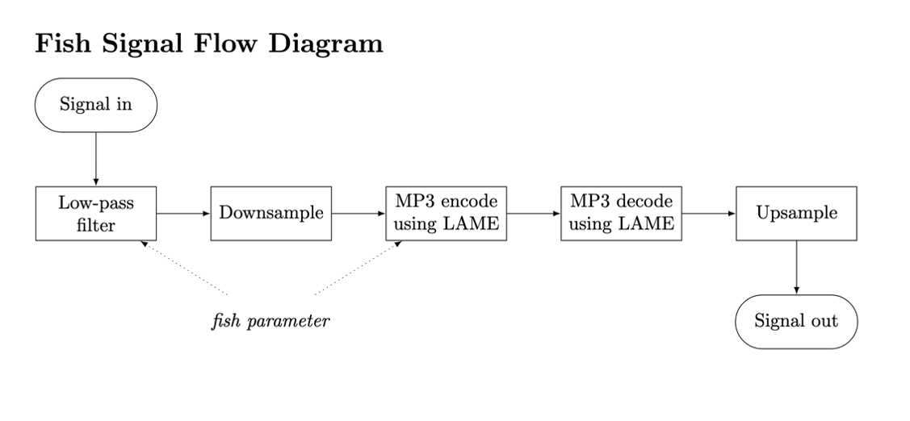
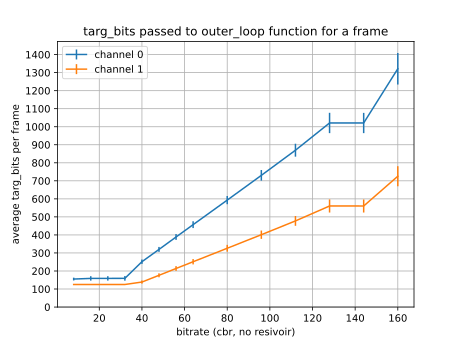

# Fish User Manual

Fish is an easy-to-use plugin with just one knob, inspired by the lossy distortion of the video "[Hey Ya Low Quality](https://youtu.be/LMaG_uOa440)." Fish’s one knob takes sound on a journey from a light lossy distortion to a distinctively nauseating low-quality sound, and finally to the limit of lossy distortion, where the sound is reduced to a sparse stippling of tones.

In designing Fish, I set out to produce a distinctive tone not found in other lossy distortion plugins. The lossy distortion of “Hey Ya Low Quality” had a full, churning tone to it that other plugins could not create. This sound intrigued me, and may have intrigued many of the commenters on the video as well.

## Using Fish

Fish has one parameter, called fish. It is controlled by dragging up and down on the GUI. At higher amounts of fish, Fish lowers the target bit value per granule, and lowers the cutoff frequency of the lowpass filter. The animation spins faster the more fish there is.

## How Fish Works

Despite the simple user interface, Fish's guts are surprisingly complicated.

After experimenting with many settings on multiple MP3 encoders, as well as various chains of filters, saturators, distortion effects, lossy distortion plugins and bitcrushers, I was finally able to design a plugin that captured the sound of “Hey Ya Low Quality” that had intrigued me. The solution I found was to speed the input audio up, apply MP3 compression, and then slow the audio back to its initial speed. The result was not a perfect match. However, this resampling and encoding process had the desired effect, removing the high end of the sound and giving it a slow, grinding MP3 compression.

Fish uses the MP3 encoder LAME to distort the audio. I used LAME for several reasons. LAME is an open-source MP3 encoder and decoder, so I could freely use the LAME library in my plugin, and even modify the LAME code. LAME is also a popular MP3 encoder, and has is used inside other pieces of open-source software, including the command-line audio processor [FFmpeg](https://trac.ffmpeg.org/wiki/Encode/MP3) and the digital audio editor [Audacity](https://manual.audacityteam.org/man/faq_installing_the_lame_mp3_encoder.html).  LAME was able to give the tone I was looking for, perhaps because of its widespread use establishing it as a de facto standard for how MP3 compression should sound. Since LAME is open source, and the patent for MP3 compression has [expired](https://www.theregister.com/2017/05/16/mp3_dies_nobody_noticed/),  there was no reason for me to not use this actual encoder to get the authentic sound I wanted from this plugin. The architecture of Fish also draws some inspiration from the plugin [LameVST](https://github.com/Iunusov/LameVST).  LameVST is a plugin that compresses audio using the LAME library. Although LameVST was not programmed using the JUCE library, it was programmed in C++, and referencing the code for LameVST was helpful in learning how to use the LAME library interface.

Designing Fish as a plugin presented other challenges besides merely identifying how to create the desired tone. Musicians generally expect a plugin to work on real-time audio with relatively low latency, and for the tone to change smoothly, without pops or gaps, as they turn the plugin’s knobs. LameVST can introduce much more latency than other plugins: in some of my tests, it delayed audio by over 450 milliseconds. To make matters worse, the amount by which it delays audio changes, apparently at random and without warning, each time the user changes a parameter. LameVST also introduces glaring gaps of silence, about 350 milliseconds long, whenever the user changes a parameter. These conditions are not necessarily a problem for LameVST. According to its author, LameVST is meant to be a plugin for “if you need to preview you [sic] track in the mp3-mode during playback.” 450 milliseconds of latency or a brief pause when changing settings would likely be acceptable to someone previewing how a track would sound as an MP3 at a specific bitrate. Fish, on the other hand, is intended for use as a musical effect, so being able to use it live, or automate the parameters without gaps, would be expected features found in the vast majority of distortion plugins.

Several settings in the LAME library helped to limit Fish’s latency. One source of delay that can be eliminated is the bit reservoir, as explained in an [FAQ page for LAME]( https://lame.sourceforge.io/tech-FAQ.txt).

> The MP3 data for frame N is not stored in frame N, but can be spread over several frames. In a typical case, the data for frame N will have 20% of it stored in frame N-1 and 80% stored in frame N. If the encoder builds up a large bit reservoir, the data for frame N can actually be stored 4088 bits back in the bitstream.

As audio data gets spread across more frames, the latency of the full encoding and decoding process grows. Luckily, the LAME API gives us the option to disable the bit reservoir, which means that each frame can be decoded as soon as it is encoded, without the need to wait for subsequent frames. The LAME API also lets us decrease delay in the encoding process further by setting the `ENCDELAY` parameter in `encoder.h`.

To achieve smooth automation, I modified the code of LAME. Unlike LameVST, Fish does not have to accurately model the sound LAME gives at a certain bitrate. The core of the LAME encoding process occurs in the file `quantize.h`, with the function call `outer_loop(gfc, cod_info, l3_xmin, xrpow, ch, targ_bits[ch]);`. This function takes a granule  of audio, the allowable distortion at each frequency (as calculated by the psychoacoustic model), the channel being encoded, and the target number of bits that should be used to encode that channel of that granule.  As seen in figure 18, the average value of targ_bits increases with the bitrate. Generally speaking, more bits are allocated to the first channel (the mid channel in mid/side encoding) than the second. If, instead of passing `targ_bits[ch]` as the final parameter in `outer_loop`, we pass some other number, we can actually change the quality.  This hack opens up three exciting possibilities. First, we can change the amount of lossy distortion on the fly, by changing the target bit value. Second, we can gradually adjust the target bit value, resulting in a smooth gradation of quality, instead of the dozen or so bitrates supported by the LAME API. Finally, we can push the target bit value even lower than even the lowest bitrates supported by LAME, resulting in an exaggerated, bubbly lossy distortion. 

This hack comes at a cost. Although it may be possible, I could not find a way to change the cutoff frequency of LAME’s low-pass filter on the fly. Since the muffled low-passed sound is an important part of the sound of lossy distortion (particularly in the sound of  “Hey Ya Low Quality”), I added a simple low-pass biquad filter on the signal before passing it into the encoder. This filter’s cutoff frequency lowers as the fish parameter raises.

To get the slow, churning distortion that I wanted from Fish required downsampling the audio before compressing it with LAME, and then upsampling it afterwards. When the signal is downsampled, each MP3 frame covers a greater amount of time, intensifying the pre-delay artifact and slowing down the bubbling sound of the birdie artifact. As shown in the signal flow diagram, Fish first applies a low-pass filter on the incoming signal. This gives the sound the desired muffled tone, while also removing much of the high-frequency signal that would fold over into as noise.  Then, Fish downsamples the signal, applies MP3 encoding and decoding, and then finally upsamples the signal to the initial sample rate. To upsample the audio, I used linear interpolation, followed by a final low-pass filter. Although linearly interpolating between samples is one of the simplest approaches, it is, [as researcher Olli Niemitalo writes](http://yehar.com/blog/wp-content/uploads/2009/08/deip.pdf), “not adequate for high-quality resampling.” Linear interpolation adds more high frequency noise than higher-order (and more computationally expensive) polynomial interpolations.  With just linear interpolation, this high frequency noise was noticeable and annoying. By following it up with low-pass filtering, this noise was reduced noticeably.

Fish also lowers the amplitude of the incoming signal by about 6 dB before processing, and raises it by 6 dB after processing. Without this step, loud signals could clip during the MP3 compression step, leading to unwanted distortion.

*For more details on messing with LAME to get low latency, see my notes [here](lame-notes.md).*