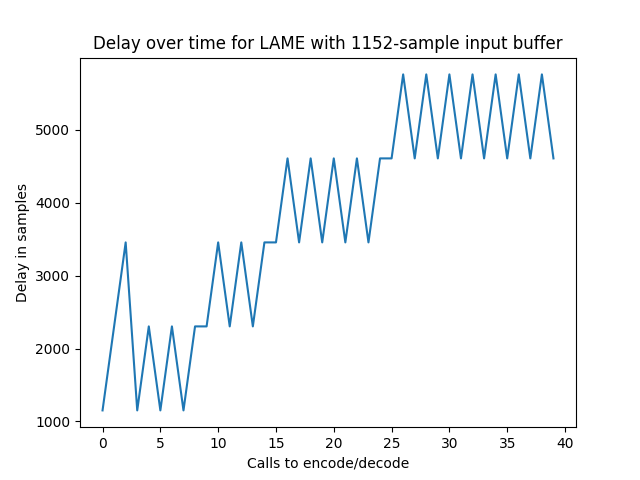
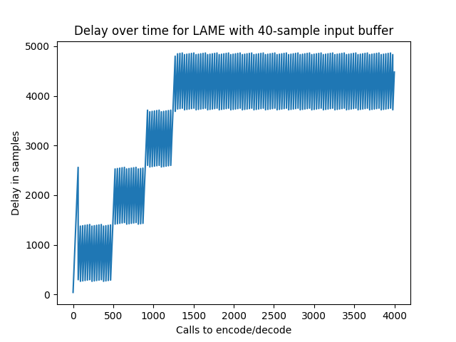

# Understanding LAME

As a part of a broader project, I needed to figure out how to make the LAME C library work in real time as an audio plugin. LAME is a popular open-source MP3 encoder, used to encode and decode audio files as MP3s. LAME has a CLI, as well as an API, defined in the `lame.h` file within the LAME source code.

In this experiment, I messed around with the LAME API to understand how best
to interact with LAME to meet my needs.

## Initializing the encoder parameters

At the beginning of `lame.h`, we have the following declaration:

```c
/***********************************************************************
 *
 *  The LAME API
 *  These functions should be called, in this order, for each
 *  MP3 file to be encoded.  See the file "API" for more documentation
 *
 ***********************************************************************/
```

First, we must initialize the encoder:

```c
/*
 * REQUIRED:
 * initialize the encoder.  sets default for all encoder parameters,
 * returns NULL if some malloc()'s failed
 * otherwise returns pointer to structure needed for all future
 * API calls.
 */
lame_global_flags * CDECL lame_init(void);
```

Then we have a bunch of optional functions that work upon these global flags:

```c
/*
 * OPTIONAL:
 * set as needed to override defaults
 */
```

There are quite a few of these. For my audio plugin, I wanted a low-quality
sound, so I set this in two ways: by setting a low bitrate as well as a low
"quality" setting. As I understand it, the quality setting determines how advanced of an algorithm to use when choosing which bitrate to use for a frame with variable bitrate. Lower quality algorithms are faster, but may waste higher bitrates on frames that don't need them.

There is one more required step: initializing the internal configuration:

```c
/*
 * REQUIRED:
 * sets more internal configuration based on data provided above.
 * returns -1 if something failed.
 */
int CDECL lame_init_params(lame_global_flags *);
```

Here's my initialization.

```c
	void *lame_enc_handler;
	int bitrate = 48;
	int samplerate = 44100;

	lame_enc_handler = lame_init();
	lame_set_in_samplerate((lame_global_flags *)lame_enc_handler, samplerate);
	lame_set_out_samplerate((lame_global_flags *) lame_enc_handler, samplerate);
	lame_set_brate((lame_global_flags *) lame_enc_handler, bitrate);
	lame_set_quality((lame_global_flags *) lame_enc_handler, 7);

	if (lame_init_params((lame_global_flags *)lame_enc_handler) != 0) {
		lame_close((lame_global_flags *)lame_enc_handler);
	}
```

## Initializing the decoder parameters

Audio plugins expect input and output to be in PCM format (like a WAV file), rather than encoded in any compressed format. This means that we need to decode the MP3 data as well. Luckily, this is quite simple:

```c
	void *lame_dec_handler;
	lame_dec_handler = hip_decode_init();
```

I built and ran my code with no problems, using:

```sh
clang -Wall -Wextra -Werror -O3 -std=c99 -pedantic -o lametest -I/usr/loca/include -L/usr/local/lib -lmp3lame lametest.c
```

(Note that I had LAME installed on my computer, and I included it in my code with `#include <lame/lame.h>`)


## Encoding with LAME

The LAME API accepts audio in a wide range of formats. In a JUCE audio plugin, we get samples as an array of IEEE floats. The header for this function is as follows:

```c
/* as lame_encode_buffer, but for 'float's.
 * !! NOTE: !! data must still be scaled to be in the same range as
 * short int, +/- 32768
 */
int CDECL lame_encode_buffer_float(
        lame_global_flags*  gfp,           /* global context handle         */
        const float         pcm_l [],      /* PCM data for left channel     */
        const float         pcm_r [],      /* PCM data for right channel    */
        const int           nsamples,      /* number of samples per channel */
        unsigned char*      mp3buf,        /* pointer to encoded MP3 stream */
        const int           mp3buf_size ); /* number of valid octets in this
                                              stream                        */
```

First, we have the encoder flags that we initialized earlier. Next we have two float arrays with the samples for each channel. We also pass in the length of the arrays. Next, we need to tell LAME where to write the encoded MP3 data, and how big the buffer is. But how big should this buffer be to be able to encode our audio?

The LAME API explains:

```c
/*
 * The required mp3buf_size can be computed from num_samples,
 * samplerate and encoding rate, but here is a worst case estimate:
 *
 * mp3buf_size in bytes = 1.25*num_samples + 7200
 *
 * I think a tighter bound could be:  (mt, March 2000)
 * MPEG1:
 *    num_samples*(bitrate/8)/samplerate + 4*1152*(bitrate/8)/samplerate + 512
 * MPEG2:
 *    num_samples*(bitrate/8)/samplerate + 4*576*(bitrate/8)/samplerate + 256
 *
 * but test first if you use that!
 *
 * set mp3buf_size = 0 and LAME will not check if mp3buf_size is
 * large enough.
 */
```

To start, let's try the worst-case bound, since allocating that much memory isn't a huge concern. 

Here's my code. For some test audio, we first fill our input arrays with white noise.

```c
	float* left_input_buffer = calloc(input_buffer_size, sizeof(float));
	float* right_input_buffer = calloc(input_buffer_size, sizeof(float));

	for (int i = 0; i < input_buffer_size; ++i) {
		left_input_buffer[i] = random_float(-1, 1);
		right_input_buffer[i] = random_float(-1, 1);
	}
```

We make our MP3 buffer.

```
	int mp3_buffer_size = input_buffer_size * 1.25 + 7200;
	unsigned char* mp3_buffer = calloc(mp3_buffer_size, sizeof(char));
```

Then, we simulate encoding a bunch of MP3 frames.

```c
int result;
	for (int i = 0; i < 400; ++i) {
		result = lame_encode_buffer_ieee_float(
			(lame_global_flags *)lame_enc_handler,
			left_input_buffer,
			right_input_buffer,
			input_buffer_size,
			mp3_buffer,
			mp3_buffer_size);

		printf("%i ", result);
	}
	printf("\n");
```

The result number is the number of bytes that have been output to the mp3 buffer. At low input buffer sizes, that numer is usually zero:
```
[input_buffer_size = 40]
0 0 0 0 0 0 0 0 0 0 0 0 0 0 0 0 0 0 0 0 0 0 0 0 0 0 0 0 0 0 0 0 0 0 148 0 0 0 0 0 0 0 0 0 0 0 0 0 0 0 0 0 0 0 0 0 0 0 0 0 0 0 0 157 0 0 0 0 0 0 0 0 0 0 0 0 0 0 0 0 0 0 0 0 0 0 0 0 0 0 0 154 0 0 0 0 0 0 0 0 0 0 0 0 0 0 0 0 0 0 0 0 0 0 0 0 0 0 0 0 161 0 0 0 0 0 0 0 0 0 0 0 0 0 0 0 0 0 0 0 0 0 0 0 0 0 0 0 0 156 0 0 0 0 0 0 0 0 0 0 0 0 0 0 0 0 0 0 0 0 0 0 0 0 0 0 0 0 156 0 0 0 0 0 0 0 0 0 0 0 0 0 0 0 0 0 0 0 0 0 0 0 0 0 0 0 0 158 0 0 0 0 0 0 0 0 0 0 0 0 0 0 0 0 0 0 0 0 0 0 0 0 0 0 0 154 0 0 0 0 0 0 0 0 0 0 0 0 0 0 0 0 0 0 0 0 0 0 0 0 0 0 0 0 158 0 0 0 0 0 0 0 0 0 0 0 0 0 0 0 0 0 0 0 0 0 0 0 0 0 0 0 0 142 0 0 0 0 0 0 0 0 0 0 0 0 0 0 0 0 0 0 0 0 0 0 0 0 0 0 0 0 139 0 0 0 0 0 0 0 0 0 0 0 0 0 0 0 0 0 0 0 0 0 0 0 0 0 0 0 0 141 0 0 0 0 0 0 0 0 0 0 0 0 0 0 0 0 0 0 0 0 0 0 0 0 0 0 0 141 0 0 0 0 0 0 0 0 0 0 0 0 0 0 0 0 0 0 0 0 
```

While at higher buffer sizes, most of our calls return bytes.
```
[input_buffer_size = 1200]
0 148 146 143 267 127 97 135 134 133 129 96 138 128 142 141 145 142 108 138 141 146 142 140 140 156 156 157 313 159 158 161 159 157 154 157 159 149 162 159 154 159 154 153 154 159 159 153 156 161 153 157 314 156 158 161 159 157 157 157 154 158 156 154 161 156 156 153 152 159 159 156 156 156 156 157 313 159 156 163 159 157 154 157 159 149 162 159 154 159 154 153 152 159 159 156 156 156 156 157 313 159 158 161 159 157 154 157 159 156 156 155 154 160 156 153 154 159 159 153 156 161 153 157 313 159 156 161 159 157 157 157 154 158 156 154 161 156 156 153 152 159 159 156 156 156 156 157 313 159 156 163 159 157 154 157 159 149 162 159 154 159 154 153 152 159 159 156 156 156 156 157 313 159 158 161 159 157 154 157 159 156 156 155 154 163 154 153 152 159 159 156 156 156 156 157 313 159 156 163 159 157 154 157 159 149 162 154 154 152 159 150 170 156 154 156 156 156 156 157 313 159 156 163 159 157 154 157 159 149 162 159 154 159 154 153 152 159 159 156 156 156 156 157 313 159 158 161 159 157 154 157 159 156 156 155 154 163 154 153 152 159 159 156 156 156 156 157 313 159 156 163 159 157 154 157 159 149 162 159 154 159 154 153 152 159 159 156 156 156 156 157 313 159 158 161 159 157 154 157 159 149 162 159 154 159 154 153 154 159 159 153 156 161 153 157 314 156 158 161 159 157 157 157 154 158 156 154 161 156 156 153 152 159 159 156 156 156 156 157 313 159 156 163 159 157 154 157 159 149 162 159 154 159 154 153 152 159 159 156 156 156 156 157 313 159 158 161 159 157 154 157 159 156 156 155 154 160 156 153 154 159 159 153 156 161 153 157 313 159 156 163 159 157 154 157 159 149 162 154 
```

And at much higher buffer sizes, the calls return a lot of bytes:
```
[input_buffer_size = 12,000]
1307 1308 1676 1553 1585 1710 1576 1724 1568 1571 1722 1568 1724 1568 1723 1553 1585 1708 1578 1724 1568 1571 1722 1568 1724 1568 1723 1554 1574 1719 1576 1724 1569 1571 1722 1568 1724 1568 1723 1554 1574 1724 1571 1724 1569 1571 1717 1571 1723 1571 1722 1552 1577 1724 1571 1723 1570 1568 1720 1574 1720 1566 1727 1555 1574 1724 1558 1737 1568 1571 1722 1570 1720 1558 1736 1564 1564 1724 1571 1724 1568 1571 1722 1568 1724 1568 1713 1575 1573 1708 1578 1724 1568 1571 1722 1568 1724 1568 1723 1554 1574 1719 1576 1724 1569 1571 1722 1568 1724 1568 1723 1554 1574 1724 1571 1724 1569 1571 1717 1571 1723 1571 1722 1552 1577 1724 1571 1723 1570 1568 1720 1574 1720 1566 1727 1555 1574 1724 1558 1737 1568 1571 1722 1570 1720 1558 1736 1552 1576 1724 1571 1724 1568 1571 1722 1568 1724 1568 1713 1575 1573 1710 1576 1724 1568 1571 1722 1568 1724 1568 1723 1554 1574 1719 1576 1725 1574 1563 1724 1568 1724 1568 1723 1554 1574 1725 1570 1724 1569 1571 1717 1571 1723 1571 1723 1554 1574 1724 1571 1728 1564 1569 1720 1571 1723 1566 1727 1555 1574 1724 1558 1737 1568 1571 1722 1570 1720 1566 1728 1552 1576 1724 1558 1737 1568 1571 1722 1569 1721 1558 1727 1573 1563 1719 1577 1724 1568 1571 1722 1568 1724 1568 1723 1554 1574 1719 1576 1725 1574 1563 1724 1568 1724 1568 1723 1554 1574 1725 1570 1724 1569 1571 1717 1571 1726 1568 1723 1554 1574 1724 1571 1728 1564 1569 1720 1571 1723 1566 1727 1555 1574 1724 1558 1737 1568 1571 1722 1570 1720 1566 1728 1552 1576 1724 1558 1737 1568 1571 1722 1569 1721 1558 1736 1564 1563 1719 1577 1724 1568 1571 1722 1568 1724 1568 1723 1554 1574 1719 1576 1725 1574 1566 1721 1568 1724 1568 1723 1554 1574 1725 1570 1724 1569 1571 1717 1571 1726 1568 1723 1554 1574 1724 1571 1728 1571 1563 1718 1574 1721 1571 1722 1555 1574 1724 1571 1723 1570 1570 1722 1570 1720 1566 1728 1554 1574 1724 1558 1737 1568 1571 1722 1569 1721 1558 1736 1564 1563 1720 1576 1724 1568 1571 1722 1568 1724 1568 1723 1554 1574 1719 1576 1725 1568 1571 1722 1568 1724 1568 1723 1554 
```

So how many samples does LAME need to stock up before it is able to encode them? The simple answer is 1152, which is the size of an MP3 frame. But when we run our testing program, we get an interesting result:

```
[input_buffer_size = 1152]
0 148 148 144 144 138 138 138 138 102 138 138 138 138 138 108 150 150 150 144 142 142 142 142 142 106 142 142 142 142 142 142 142 157 157 157 157 157 157 157 157 157 157 155 157 157 157 157 157 157 155 157 157 157 157 157 157 157 155 157 157 157 157 157 157 157 155 157 157 157 157 157 157 155 157 157 157 157 157 157 157 155 157 157 157 157 157 157 155 157 157 157 157 157 157 157 155 157 157 157 157 157 157 155 157 157 157 157 157 157 157 155 157 157 157 157 157 157 155 157 157 157 157 157 157 157 155 157 157 157 157 157 157 155 157 157 157 157 157 157 157 155 157 157 157 157 157 157 155 157 157 157 157 157 157 157 155 157 157 157 157 157 157 157 155 157 157 157 157 157 157 155 157 157 157 157 157 157 157 155 157 157 157 157 157 157 155 157 157 157 157 157 157 157 155 157 157 157 157 157 157 155 157 157 157 157 157 157 157 155 157 157 157 157 157 157 155 157 157 157 157 157 157 157 155 157 157 157 157 157 157 155 157 157 157 157 157 157 157 155 157 157 157 157 157 157 155 157 157 157 157 157 157 157 155 157 157 157 157 157 157 157 155 157 157 157 157 157 157 155 157 157 157 157 157 157 157 155 157 157 157 157 157 157 155 157 157 157 157 157 157 157 155 157 157 157 157 157 157 155 157 157 157 157 157 157 157 155 157 157 157 157 157 157 155 157 157 157 157 157 157 157 155 157 157 157 157 157 157 155 157 157 157 157 157 157 157 155 157 157 157 157 157 157 155 157 157 157 157 157 157 157 155 157 157 157 157 157 157 157 155 157 157 157 157 157 157 155 157 157 157 157 157 157 157 155 157 157 157 157 157 157 155 157 157 157 157 157 157 157 155 157 157 157 157 157 157 155 157 157 
```

Why isn't LAME able to return anything from the first frame, even though we gave it 1152 samples? The answer can be found deep in the [LAME Technical FAQ](https://lame.sourceforge.io/tech-FAQ.txt).

```
ENCODER DELAY AT START OF FILE:

ISO based encoders (BladeEnc, 8hz-mp3, etc) use a MDCT/filterbank
routine similar to the one used in decoding, and thus also introduce
their own 528 sample delay....


The FhG encoder (at highest quality) introduces a 1160 sample delay,
for a total encoding/decoding delay of 1688 samples.  I haven't tested
Xing.

Starting with LAME 3.55, we have a new MDCT/filterbank routine written
by Takehiro Tominaga with a 48 sample delay....
you can decrease the 
the encoder delay by setting ENCDELAY in encoder.h.  The default
right now is 576.  
```

However, even this doesn't quite give the answer. I changed my code to have a slightly longer buffer size in the first call to encode. Then, I played around with that added length until I found the shortest length of the first buffer that acually returned MP3 data. For most bitrates, this turned out to actually be 224 samples, although for higher bitrates no extra samples were needed.

## Decoding with LAME

Next, we need to decode our audio back to MP3. The decode function is simple enough:

```c
/*********************************************************************
 * input 1 mp3 frame, output (maybe) pcm data.
 *
 *  nout = hip_decode(hip, mp3buf,len,pcm_l,pcm_r);
 *
 * input:
 *    len          :  number of bytes of mp3 data in mp3buf
 *    mp3buf[len]  :  mp3 data to be decoded
 *
 * output:
 *    nout:  -1    : decoding error
 *            0    : need more data before we can complete the decode
 *           >0    : returned 'nout' samples worth of data in pcm_l,pcm_r
 *    pcm_l[nout]  : left channel data
 *    pcm_r[nout]  : right channel data
 *
 *********************************************************************/
int CDECL hip_decode( hip_t           gfp
                    , unsigned char * mp3buf
                    , size_t          len
                    , short           pcm_l[]
                    , short           pcm_r[]
                    );
```

I wrote some quick code to decode what we encoded:

```c
	// Double length for safety
	short* left_output_buffer = calloc(input_buffer_size * 2, sizeof(short));
	short* right_output_buffer = calloc(input_buffer_size * 2, sizeof(short));
...
	for (int i = 0; i < 400; ++i) {
		if (i == 0) {
			in_size = input_buffer_size + encoder_delay;
		} else {
			in_size = input_buffer_size;
		}
		enc_result = lame_encode_buffer_ieee_float(
			(lame_global_flags *)lame_enc_handler,
			left_input_buffer,
			right_input_buffer,
			in_size,
			mp3_buffer,
			mp3_buffer_size);

		dec_result = hip_decode(
			(hip_global_flags *)lame_dec_handler,
			mp3_buffer,
			enc_result,
			left_output_buffer,
			right_output_buffer);

		printf("%i\t%i\n", enc_result, dec_result);
	}
```

Going into the code, 

This also introduces some delay, as described in the LAME Technical FAQ.

```
DECODER DELAY AT START OF FILE:

All *decoders* I have tested introduce a delay of 528 samples.  That
is, after decoding an mp3 file, the output will have 528 samples of
0's appended to the front.  This is because the standard
MDCT/filterbank routines used by the ISO have a 528 sample delay.
```

How can we decrease the delay of encoding and decoding with LAME? We are able to turn down the encoder delay, by changing a constant in the file `encoder.h`:

```c
/* 
 * ENCDELAY  The encoder delay.  
 *
 * Minimum allowed is MDCTDELAY (see below)
 *  
 * The first 96 samples will be attenuated, so using a value less than 96
 * will result in corrupt data for the first 96-ENCDELAY samples.
 *
 * suggested: 576
 * set to 1160 to sync with FhG.
 */

#define ENCDELAY      576
```

But before going into that, there's a more glaring source of delay. In running the test code above, we get an interesting pattern. In the example below, call encode and decode on every buffer of 1152 samples. The first column lists number of bytes that the encoder writes. We then feed those bytes into the decoder, which spits out the number of samples listed in the second column.

```
0	0
148	0
148	0
144	3456
144	0
138	2304
138	0
138	2304
138	0
102	1152
138	0
138	2304
138	0
138	2304
138	0
108	1152
150	0
150	2304
150	0
144	2304
142	0
142	2304
142	0
142	2304
142	0
106	1152
142	0
142	2304
142	0
142	2304
```

After the first few frames, the decoder oscillates between returning samples and not returning samples. Graphing this, we can see the amount of delay creeping up, before settling into an osscilation. 



We get a similar pattern even after changing the size of the buffers we push into the encoder.




Once again the LAME technical FAQ gives some clues:

```
The MP3 data for frame N is not stored in frame N, but can be spread
over several frames.  In a typical case, the data for frame N will
have 20% of it stored in frame N-1 and 80% stored in frame N.  
If the encoder builds up a large bit reservoir, 
the data for frame N can actually be stored 4088 bits back in
the bitstream.
```

According to the FAQ, if you `Create mp3's with the --nores option in LAME`, the encoder will not use the bit reservoir. Sure enough, adding this option to our code fixes the problem. After a slight delay at the start, our decoder spits out 1152 samples each time, resulting in much less of a delay.

```c
  lame_set_disable_reservoir((lame_global_flags *)lame_enc_handler, 1);
```

```
0 0
104 0
105 0
104 3456
105 1152
104 1152
105 1152
104 1152
105 1152
104 1152
105 1152
104 1152
105 1152
104 1152
105 1152
104 1152
105 1152
104 1152
105 1152
104 1152
105 1152
104 1152
105 1152
```

While this does result in a slight decrease in quality, this is not a concern, since my goal *is* low-quality MP3 sound.

