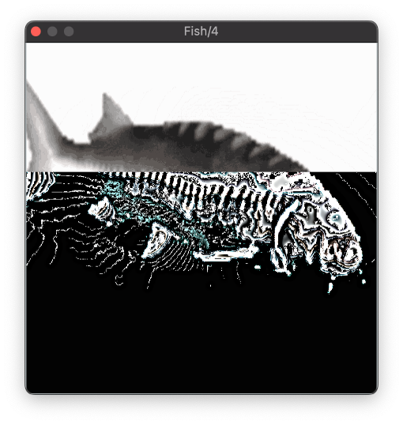

# Fish

- Fish is the one-knob plugin that dares to ask: what if your song sounded *worse*?
- Hacked together from the guts of a real MP3 encoder, Fish delivers distinct low-quality sound without making you slog through the theory.
- Free downloads for Mac, Windows *and* Linux.
- Code is open-sourced: under the GPL-3.0 license, and available right here on Github: you can build, hack, and tinker with Fish yourself. Just release your changes under the same license.

I made Fish as a part of my undergraduate thesis at the University of Oregon. Go ducks et al.

[See Fish in action](https://youtu.be/x2X7x6drGhg)!

[Read the manual](Docs/MANUAL.md).

Fish's partner plugin is [Empy](https://github.com/ArdenButterfield/Empy/), who is much more professional and put together than Fish could ever be. Empy has lots of knobs, which Fish doesn't always understand. That said, Empy and Fish love each other very much, and are very proud of their kid [Maim](https://github.com/ArdenButterfield/Maim/), who will go on to do great things some day.

## Installation Instructions

Under the [releases](https://github.com/ArdenButterfield/Empy/releases/) tab from this page, download the file corresponding to your operating system. 

On Windows or Mac, follow the instructions in the installer to install the plugin to your plugins folder. 

On Linux, you'll have to copy `Fish.vst3` to your plugin folder. Often this is at `~/.vst3`, but if you're making music on Linux you're probably already a step ahead of me.

If you have any issues, please raise an issue on the issues page of this repository and describe your situation.