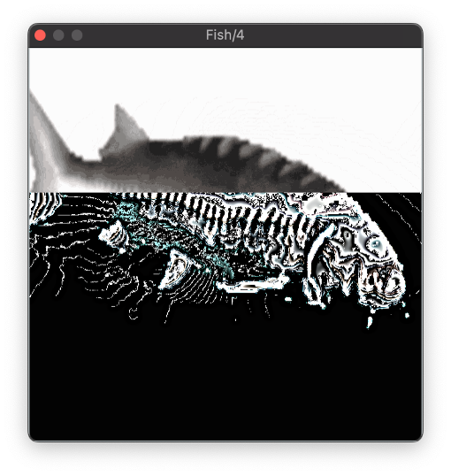

# Fish



- Fish is the one-knob plugin that dares to ask: what if your song sounded *worse*?
- Hacked together from the guts of a real MP3 encoder, Fish delivers distinct low-quality sound without making you slog through the theory.
- Free Mac download, Windows download in the works.
- Code is open-sourced: under the GPL-3.0 license, and avaliabe right here on Github: you can build, hack, and tinker with Fish yourself.

I made Fish as a part of my undergraduate thesis at the University of Oregon.

[See Fish in action](https://youtu.be/x2X7x6drGhg)!

[Read the manual](MANUAL.md).

## Build instructions

Fish uses a modified version of the LAME MP3 encoding library. To compile it, run the following commands.

```sh
cd Fish/lib/lame-master
./configure
make
```

Building Fish requires the JUCE library. Open `Fish.jucer` in Projucer. If Necessary, update the path to JUCE in Projucer. If building in XCode, click the "Save and Open in IDE" button; otherwise, create a new build target for the build system you are using. In the IDE, run the build scheme.

Now, if you check the user plugin directory (`~/Library/Audio/Plug-Ins` on Mac), you should see both Empy.vst3 and Empy.component. Now, when you launch your DAW, Empy should show up in the list of plug-ins, under the manufacturer name Arden Butterfield.

